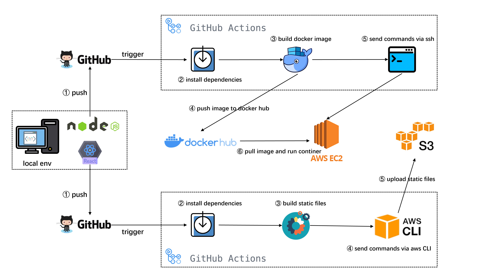

# PROJECT BIRDNEST

## Introduction
This is a pre-assignment for [Reaktor](https://www.reaktor.com/) 2023 Summer Trainee Program. Please see the [problem description](https://assignments.reaktor.com/birdnest) for detailed information.

The project contains two parts: [frontend](https://github.com/2horse9sun/birdnest_frontend) and [backend](https://github.com/2horse9sun/birdnest_backend). The frontend is implemented by React.js and deployed to AWS S3 with static website feature enabled. The backend is implemented by Node.js, built by Docker and deployed to AWS EC2.

The demo for this project is available [here](http://birdnest.s3-website-eu-west-1.amazonaws.com/).

## Architecture Design

The above figure shows the overall architecture of the project. The architecture contains four parts: Node.js server, AWS DynamoDB, React.js website and third-party APIs.

The Node.js server contains one cron job and two APIs. The cron job detects all the drones in the 500 by 500 meter square periodically and check if there are some drones entering the NDZ (No Drone Zone, a circle with a 100 meter radius). For those drones violating the NDZ, the cron job queries those drones' pilots' information and store associated entries into the Database for further display. The job is set to run every two seconds. The API `getViolationInfos` gets all the items from database, which is periodically called by React.js website. The API `updateViolationInfos` triggers the cron job for one time.

All the violation information items are stored into AWS DynamoDB. With the help of the item expiration feature, the database will automatically delete the items 10 minutes after they were first added. That is to say, the database persists the pilot information for 10 minutes since their drone was last seen by the equipment.

## CI/CD Pipeline

Pipeline for backend: 
1. Push code to GitHub repository and trigger a GitHub Action workflow.
2. Install all the dependencies for the project by `npm`. 
3. Build container image by Docker.
4. Push container image to Docker Hub.
5. Send commands to AWS EC2 via ssh. This step requires AWS credentials stored in GitHub Action secrets.
6. The above commands tell EC2 to pull the container image from Docker Hub and run the container.

Pipeline for frontend: 
1. Push code to GitHub repository and trigger a GitHub Action workflow.
2. Install all the dependencies for the project by `npm`. 
3. Build website static files by `npm`.
4. Send commands to AWS S3 via AWS CLI. This step requires AWS credentials stored in GitHub Action secrets.
5. The above commands upload website static files to S3. S3's static website hosting feature should be enabled.